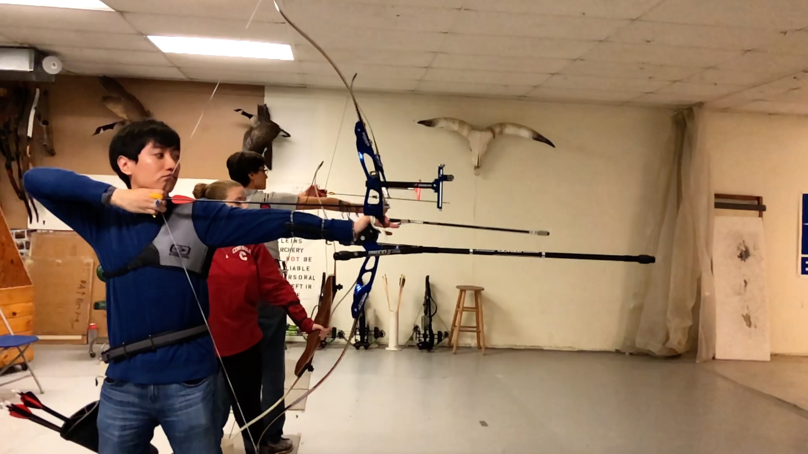

# [Research](#research)
I am broadly interested in Natural Language Processing and Machine Learning methods that can be used to automatically learn the underlying knowledge in languages.

On the methodology side, I am intrigued by elegant models with end-to-end training,  such as the capability of Deep Neural Networks to learn powerful representations without explicitly injecting human knowledge. I am also interested in structured prediction models that can handle complex output spaces since NLP problems usually have structured outputs.

On the application side, I am very interested in extracting and understanding knowledge behind languages, such as Question Answering, Reading Comprehension, or representation learning.

Recently, my proposed thesis research focuses on studying Adversarial Neural Networks with applications in NLP, particularly for cross-lingual and cross-domain adaptation.

# [Publications](#publications)

**Multinomial Adversarial Networks for Multi-Domain Text Classification** 
_Xilun Chen_, Claire Cardie 
(To appear) The 16th Annual Conference of the North American Chapter of the Association for Computational Linguistics: Human Language Technologies (NAACL HLT 2018) 
[arXiv](https://arxiv.org/abs/1802.05694), [code](https://github.com/ccsasuke/man)

**Adversarial Deep Averaging Networks for Cross-Lingual Sentiment Classification** 
_Xilun Chen_, Yu Sun, Ben Athiwaratkun, Claire Cardie and Kilian Weinberger 
[arXiv](<https://arxiv.org/abs/1606.01614>), [bibtex](resources/bibtex/adan.bib)

**A Rectangle Mining Method for Understanding the Semantics of Financial Tables** 
_Xilun Chen_, Laura Chiticariu, Marina Danilevsky, Alexandre Evfimievski and Prithviraj Sen 
The 14th IAPR International Conference on Document Analysis and Recognition (ICDAR 2017) 
[proceedings](http://ieeexplore.ieee.org/document/8269983/),
[pdf](resources/papers/TableExtraction.pdf),
[bibtex](resources/bibtex/remine.bib),
[dataset](resources/data/FinancialTableDataset.zip)

**Combining Global Models for Parsing Universal Dependencies** 
Tianze Shi, Felix G. Wu, _Xilun Chen_ and Yao Cheng 
Proceedings of the CoNLL 2017 Shared Task: Multilingual Parsing from Raw Text to Universal Dependencies (CoNLL 2017) 
[pdf](http://aclweb.org/anthology/K17-3003), [bibtex](https://aclanthology.info/papers/K17-3003/k17-3003.bib)

**Price of Anarchy of Innovation Diffusion in Social Networks** 
_Xilun Chen_ and Chenxia Wu, WINE 2014 (Poster) 
[pdf](https://arxiv.org/pdf/1407.7319.pdf)

**Multi-Domain Adaptation for SMT Using Multi-Task Learning** 
Lei Cui, _Xilun Chen_, Dongdong Zhang, Shujie Liu,m Mu Li and Ming Zhou 
Proceedings of the 2013 Conference on Empirical Methods in Natural Language Processing (EMNLP 2013) 
[pdf](http://aclweb.org/anthology/D13-1107), [bibtex](https://aclanthology.info/papers/D13-1107/d13-1107.bib)

# [Experiences](#experience)
05.2017 - 08.2017, **Facebook**, Menlo Park, CA, 
*PhD Intern working with the Search NLP team*\\
Worked on Aspect Extraction on review data. E.g. In review `I like the food but the service is terrible.`, the system should extract `food` as a positive aspect while extracting `service` as a negative one.

05.2016 - 08.2016, **IBM Research**, San Jose, CA, 
*Research Intern with the Scalable NLP team*\\
Worked on understanding the structure and semantics of tabular data in financial documents.
Our paper was published on ICDAR 2017.

05.2015 - 08.2015, **Google**, Mountain View, CA, 
*PhD Intern with the Display Ads Predictive Targeting team*\\
Implemented a new targeting model based on Slope One collaborative filtering to recommend keywords to Ads for better coverage using only keyword performance statistics.

05.2012 - 02.2013, **Microsoft Research Asia**, Beijing, China, 
*Full-time Intern working on Machine Translation with Dr. Dongdong Zhang and Dr. Ming Zhou*
Designed an all-in-one GUI Auto Trainer for the Machine Translation pipeline of MSRA.
Participated in a real-time speech-to-speech machine translation task ([News](http://www.bbc.co.uk/news/technology-20266427), [Video](https://www.youtube.com/watch?v=Nu-nlQqFCKg))

# [Teaching](#teach)
TA for [CS4300](http://www.cs.cornell.edu/courses/cs4300/2017sp/): Language and Information

TA for [CS4740/5740](https://www.cs.cornell.edu/courses/cs4740/2015sp/): Introduction to Natural Language Processing

TA for [CS2110](https://www.cs.cornell.edu/courses/cs2110/2014fa): Object-Oriented Programming and Data Structures

# [Miscellaneous](#misc)
I cook on a daily basis when I'm stuck in Ithaca where good Chinese food is scarce.

I do <a href="#" data-toggle="modal" data-target="#archeryModal">archery</a> (mostly indoor Olympic-style recurve archery) in my spare time, and sometimes go skiing when weather permits.

  

    <!-- Modal content-->
    

      

        <button type="button" class="close" data-dismiss="modal">&times;</button>
        <h4 class="modal-title">See me shooting</h4>
      

      

      

<!--      

        <button type="button" class="btn btn-default" data-dismiss="modal">Close</button>
      

-->
    

  

